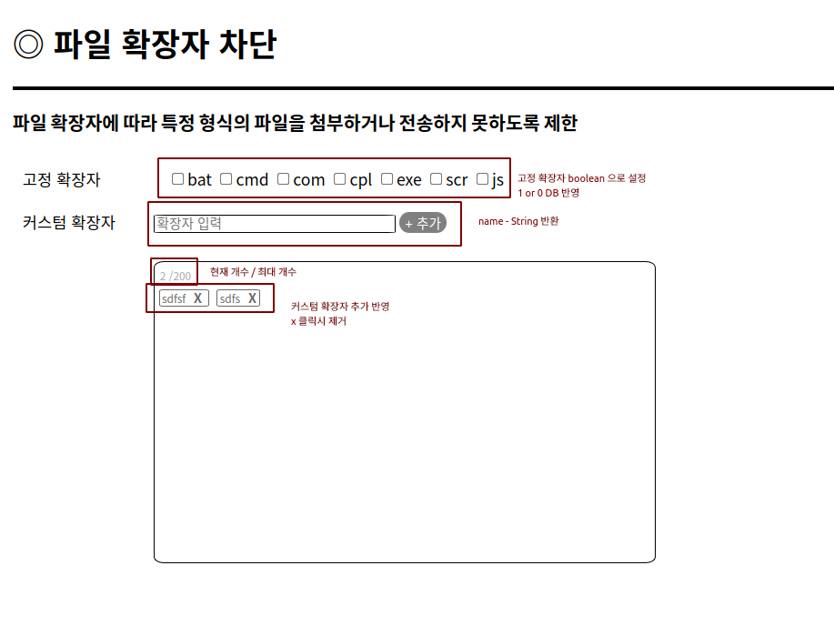
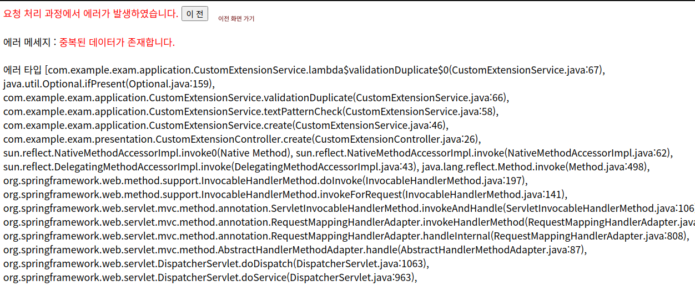
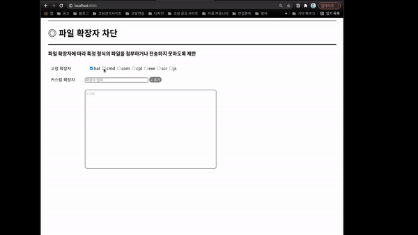

# 파일 확장자 차단

### 사용언어
Frontend
- `HTML`  `css`
- `thymeleaf`

Backend
- `java 8`
- `springBoot 2.x`
- `Junit5`
- `JPA`
- `H2 Database` => MySQL처럼 사용

## 요구사항
#### 파일 확장자에 따라 특정 형식의 파일을 첨부하거나 전송하지 못하도록 제한
- [x] 고정 확장자는 차단을 자주하는 확장자를 리스트이며, default는 unCheck되어져 있다.
- [x] 고정 확장자를 check or unCheck를 할 경우 db에 저장됩니다. - 새로고침시 유지되어야합니다.
     (아래쪽 커스텀 확장자에는 표현되지 않으니 유의)
- [x] 확장자 최대 입력 길이는 20자리
- [x] 추가버튼 클릭시 db 저장되며, 아래쪽 영역에 표현된다.
- [x] 커스텀 확장자는 최대 200개까지 추가가 가능
- [x] 확장자 옆 X를 클릭시 db에서 삭제

## 추가 고려 사항
- [x] 중복 데이터 존재시 오류 반환
- [x] 영어 이외의 커스텀 확장자명 입력시 오류 반환
- [X] 고정 확장자명을 커스텀 확장자에 입력시 오류 반환

## 추가 기능
- Exception Handling : 오류페이지 반환
  (이름중복, 빈칸입력, 영어 외의 입력, 데이터 초과, 데이터 길이 초과)
- 페이지에서 빈칸 입력시 메시지 출력

## 데이터베이스
- 2개의 Table 설정 ( 고정확장자, 커스텀 확장자 )
- 고정확장자 : 하나의 레코드 (추가 x) - update 실행
- 커스텀 확장자 : save, delete 실행

## 설명

## 실행화면
